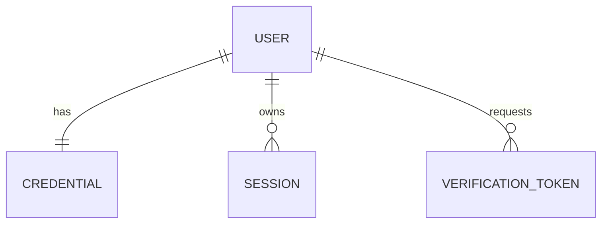

# ADR 0001: Separation of Credentials, Sessions, and Verification Tokens from User Profile

* **Status**: Accepted (Proposed by User, Approved by Team)
* **Date**: 2026-07-08

---

## Context

In standard database designs for simple applications, user profile details (name, email, avatar), password hashes, session tokens, and temporary verification tokens (password resets, email verification) are often stored directly within a single `User` table. 

However, in a multi-tenant Ecommerce Marketplace where:
1. User profiles are queried extremely frequently (e.g., displaying seller names on product detail pages, customer names in reviews, or billing information).
2. Sessions are created, updated, and validated on every API request.
3. Access security is paramount.

Storing all these details in one flat table presents security risks (accidental exposure of password hashes in SELECT queries) and performance bottlenecks (bloated row sizes, index fragmentation due to frequent updates on session/token tables).

## Decision

We will separate user identity and profile information from credentials, session state, and verification tokens into four distinct tables:

1. **`User`**: Holds non-sensitive identity metadata (firstName, lastName, email, avatar, status).
2. **`Credential`**: Holds sensitive credentials (`passwordHash` and `changedAt`). It has a strict 1-to-1 relationship with `User`.
3. **`Session`**: Tracks active login sessions (`tokenHash`, `ipAddress`, `userAgent`, `expiresAt`). It has a 1-to-Many relationship with `User`.
4. **`VerificationToken`**: Tracks short-lived validation states (`tokenHash`, `type`, `expiresAt`, `usedAt`). It has a 1-to-Many relationship with `User`.

## Importance & Rationale

* **Security Boundaries**: By separating `Credential` and `Session` into different tables, we prevent developers or automatic queries (e.g., `db.user.findMany()`) from inadvertently retrieving or logging password hashes or active session tokens.
* **Separation of Concerns**: User profiles contain static domain data. Credentials and sessions contain transient, operational security data.
* **Index Efficiency**: Session tables experience high write activity (updates to `lastActivity` or `expiresAt` on every request). Keeping these writes isolated prevents lock escalation and index fragmentation on the core `User` table.

## Scalability Analysis

### Pros (Scalability & Performance)
* **Smaller Row Size**: The core `User` table stays thin, allowing databases to fit more user rows into memory (buffer pool/cache). This improves query speed for read-heavy operations.
* **Session Shifting**: In the future, if the database write load from sessions becomes too high, the `Session` table can be easily extracted and moved to a separate high-throughput store (e.g., Redis or DynamoDB) without modifying the schema or relations of the `User` or `Credential` tables.
* **Independent Indexes**: Indexes on `Session.tokenHash` and `VerificationToken.tokenHash` are separate from the core user indexes, making lookups during request validation highly efficient.

### Cons (Trade-offs & Constraints)
* **Join Overhead**: Authenticating a user requires querying both `User` and `Credential` tables (a database `JOIN` or multiple queries). This adds a minor overhead during registration, login, and password changes.
* **Transaction Management**: Creating a new user requires writing to both the `User` and `Credential` tables inside a database transaction to ensure atomicity.
* **Cascading Deletes**: If a user is deleted, all related credentials, sessions, and verification tokens must be deleted. This is handled via database-level cascading deletes (`onDelete: Cascade`), which must be configured carefully.
