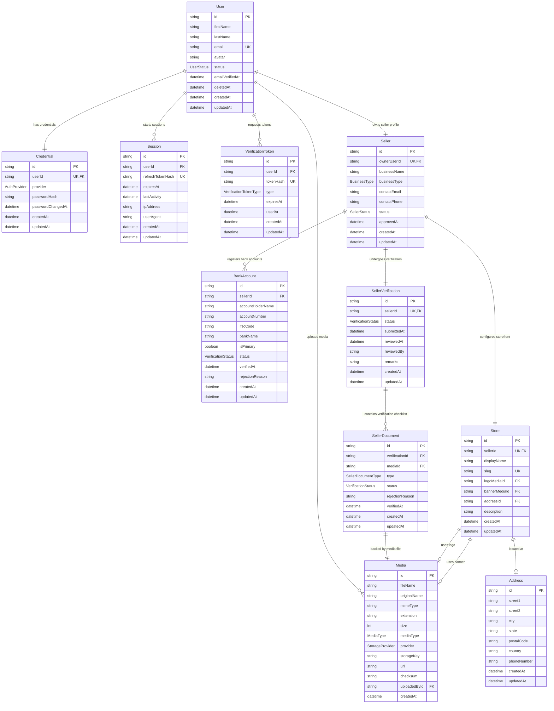

# ADR 0002: Modular Database Design for Seller Profiles, Stores, and Onboarding Verification

* **Status**: Accepted
* **Date**: 2026-07-08

---

## Context

In a multi-vendor marketplace, registering a seller is not a simple one-click action. It requires a comprehensive compliance and KYC (Know Your Customer) flow that includes:
1. Business structure details (e.g., Sole Proprietorship, LLP, Pvt Ltd).
2. Contact details (email, phone).
3. Supporting legal documents (e.g., GST registration, PAN card, Business License).
4. Financial payout destinations (e.g., verified bank accounts, IFC codes).
5. Administrative approval/verification states (pending, approved, rejected, suspended).

Storing all these details inside a single flat `Seller` model leads to database bloat, difficulty in managing historical KYC records, security issues (sensitive bank details accessible on profile checks), and difficulty in supporting multi-banking setups.

## Decision

We will implement a modular, relational database structure for the Seller module, dividing concerns into five distinct tables within the `packages/db/prisma/schema/seller` folder:

1. **`Seller`**: The parent seller profile. Links 1-to-1 to a `User` (owner) and manages the overall seller status.
2. **`Store`**: The public-facing store branding (display name, slug, description, logos/banners). It has a 1-to-1 relationship with `Seller`.
3. **`BankAccount`**: Tracks bank credentials for payouts. It has a 1-to-Many relationship with `Seller` to allow multiple accounts (with one set as `isPrimary`).
4. **`SellerVerification`**: An administrative model mapping the KYC review lifecycle (remarks, submission date, reviewer ID). It has a 1-to-1 relationship with `Seller`.
5. **`SellerDocument`**: Individual KYC documents (GST, PAN) uploaded by the seller. It maps a physical `Media` file to a document type and its specific verification status. It belongs to `SellerVerification` (1-to-Many).

## Rationale & Scalability Analysis

### Pros
* **Isolation of Sensitive Data**: Bank accounts and legal documents are separated from the core `Seller` model. APIs serving public seller profile pages only need to query `Seller` and `Store`, preventing accidental leakage of KYC files or banking details.
* **Separation of Media Storage from Verification Metadata**: Using a shared generic `Media` table for all uploaded files (user avatars, product images, KYC documents) keeps the file storage metadata unified, while `SellerDocument` holds the contextual metadata (e.g. document type, approval status).
* **Flexible Bank Configurations**: Storing bank accounts in a separate table allows sellers to configure multiple payout destinations (e.g. primary billing, fallback payout) and tracks the individual verification status of each account.
* **Audit Trail Security**: `SellerVerification` acts as an auditable log of the seller’s compliance state, tracking administrative reviews (`reviewedBy`, `remarks`) without modifying the active seller profile details.

### Cons
* **Relational Query Complexity**: Generating a complete seller onboarding dashboard in the admin portal requires joining 5 different tables. This can be optimized by using Prisma's `include` API or creating database views for administrative reports.
* **Cascading Delete Risks**: If a Seller profile is deleted, all bank accounts, verification logs, and document references must cascade delete. This is configured via Prisma's `onDelete: Cascade` rules to ensure orphan rows do not accumulate.
