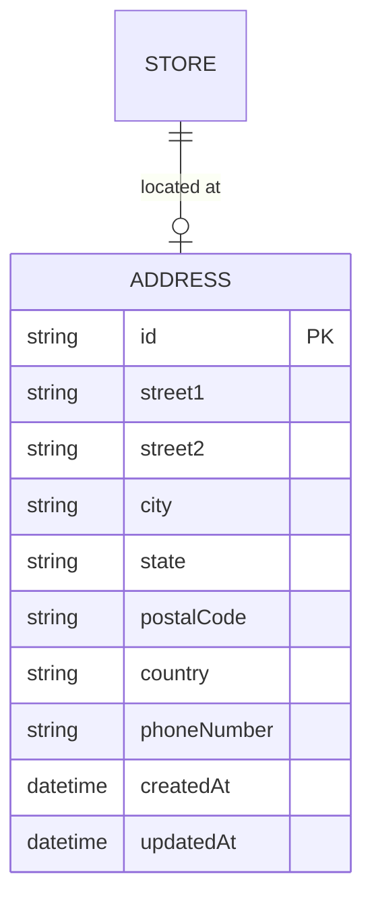

# ADR 0004: Shared Address Model and Store Address Integration

* **Status**: Accepted
* **Date**: 2026-07-08

---

## Context

In an Ecommerce Marketplace, addresses are used across multiple modules:
1. **Stores**: Physical business locations, warehouse pickup addresses.
2. **Customers**: Shipping addresses, billing addresses.
3. **Sellers**: Corporate/legal addresses (for tax compliance and KYC).
4. **Orders**: Snapshotted delivery destinations.

Design options for addresses:
* **Option A: Duplicated fields**: Add `street1`, `city`, `postalCode` directly to `Store`, `UserAddress`, `SellerDetails`, etc.
* **Option B: Shared `Address` table**: Create a normalized, central `Address` model that other modules reference via foreign keys.
* **Option C: JSON fields**: Store addresses as unstructured or schema-validated JSON fields.

## Decision

We will implement **Option B (Shared `Address` table)** coupled with **Option C (JSON snapshots)** for historical logs like Orders. 

1. Create a reusable `Address` model in `packages/db/prisma/schema/shared.prisma`.
2. Connect `Store` (in `packages/db/prisma/schema/seller.prisma`) to `Address` via a 1-to-1 optional relationship (allowing drafts to skip addresses, but requiring them for activation).

---

## Scalability & Performance Analysis

### Pros
* **Schema Consistency**: Consolidates formatting, country codes, postal validations, and address-parsing rules under a single model structure.
* **Geocoding & Tax Integration**: Integrations with shipping calculators (e.g., Shippo/EasyPost) or tax calculation engines (e.g., Avalara) can operate on a unified Address object model.
* **Clean Data Boundaries**: Keeps the core `Store` table focused on business profile metadata while offloading spatial/location queries to the `Address` table.

### Cons
* **Join Overhead**: Fetching a storefront along with its location requires a `JOIN` on the `Address` table.
* **Address Immutability Issue**: If a Store or Customer edits their address, we must ensure it does not retroactively change the address history of past transactions. To mitigate this:
  * For **Orders**: Address details must be snapshotted as immutable JSON objects at checkout time (`ParentOrder.shippingAddress`).
  * For **Profiles**: Updating an address should create a *new* database record and update the foreign key, rather than editing the existing record in-place if it has historical references.
